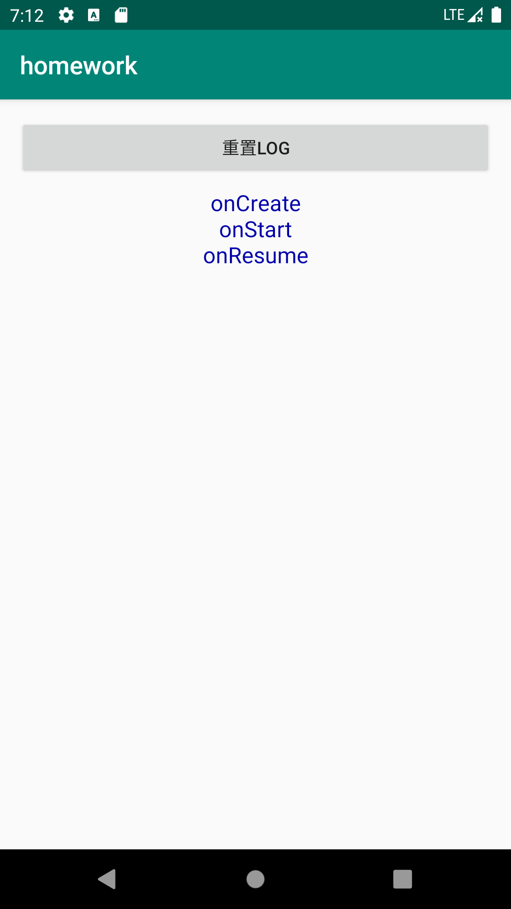
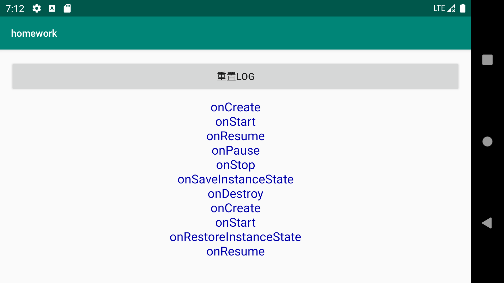
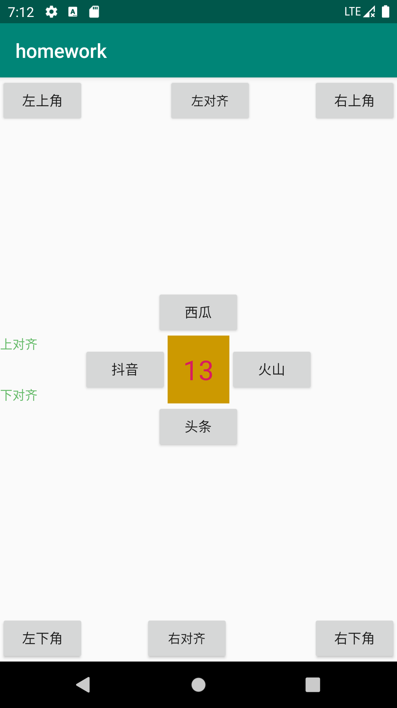
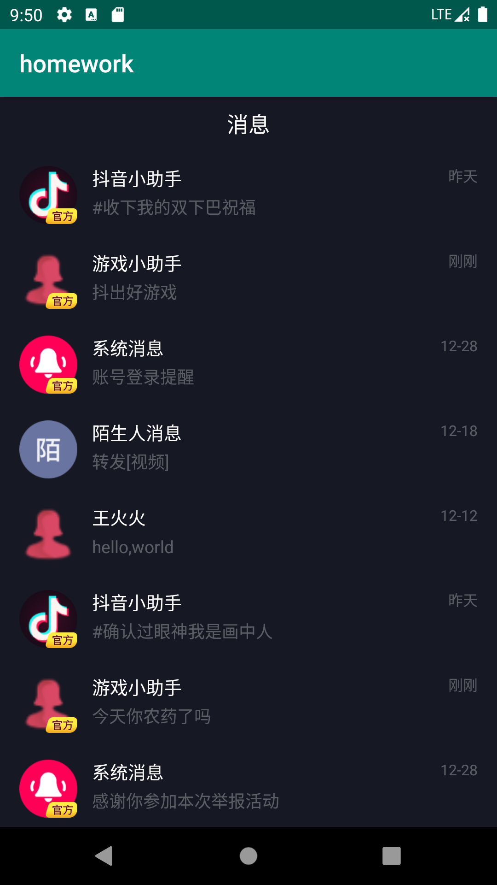
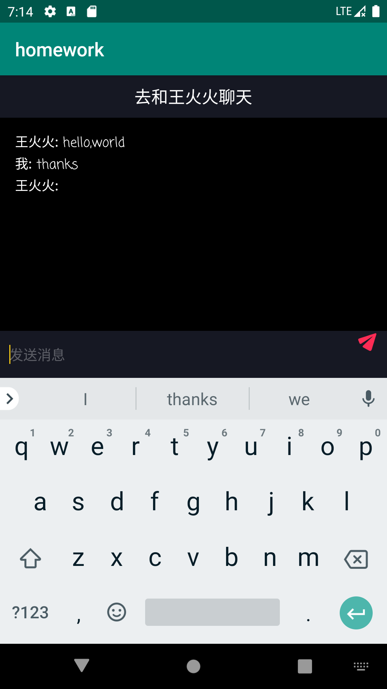

# Assignment 2
Android基础UI开发

* app📁: 课堂演示代码
* homework📁: 课后作业
* homework-debug.apk 是课后作业的示例，可以使用
  adb install -t homework-debug.apk 进行安装
  * Note ：示例代码和自己完成的 homework 代码不能同时在同一个虚拟机上安装（重名）需要在安装之前卸载之前的 homework app（`adb uninstall chapter.android.aweme.ss.com.homework` ）

## Section one

-   功能描述：Android 系统屏幕旋转的时Activity调用 #onStop() #onDestroy()，然后重新 #onCreate() #onStart #onResume 重新显示屏幕。
-   解题过程：我们知道用户旋转屏幕的时候往往希望界面能够保持旋转之前的信息。而一旦调用 #onDestroy()，`Activity` 即被释放，旋转前的信息丢失。Android 为开发者提供恢复原有信息的机制`OnSaveInstanceState`，函数在旋转屏幕或 `Activity` 非正常释放时调用。我们只需要在 `onCreate`函数中判断传入 `Bundle` `SavedInstanceState`是否为null，如果不为 null 根据`OnSaveInstanceState`时期保存的 static 信息进行恢复即可。

-   核心代码说明：在 `Exercise` 中定义static final 的类属性，保存应显示的 `TextView` 内容。

    ```java
    private static final ArrayList<String> liveEventRecord = new ArrayList<String>();
    ```

    在 `onCreate` 中恢复`TextView` 中内容

    ```java
    @Override
        protected void onCreate(@Nullable Bundle savedInstanceState) {
            super.onCreate(savedInstanceState);
            setContentView(R.layout.activity_exercise1);
            LifecycleDisplay = (TextView) findViewById(R.id.tv_loglifecycle);
          	
            if(savedInstanceState != null) {
                for(String record: liveEventRecord) {
                    LifecycleDisplay.append(record);
                }
            }else {
                liveEventRecord.clear();
            }
            logAndAppend(ON_CREATE);
        }
    ```

-   演示效果：

    -   Step one : click exercise one button，屏幕显示如下：

         

    -   Step two : 使模拟器旋转，屏幕显示如下：

        

## Section two

-   功能描述：统计页面所有 view 的个数。ViewGroup 中的 API: `getChildCount()`, `getChildAt()`。

-   解题过程：首先一个 `ViewGroup` 是 `View` 的子类。`getChildCount()` 函数返回以 `ViewGroup` 为根节点的`View` 及其子类 `ViewGroup` 个数。`getChildAt(int i)` 返回第 i 个 `View ` 。

    -   Note : 我在做这道题的时候研究了很久 Activity 的根 `View` 节点怎么获得答案是 `this.findViewById(android.R.id.content)`.

-   核心代码：

    ```java
    public int getAllChildViewCount(View view) {
            if(view == null) return 0;
            int viewCount = 0;
            Queue<View> queue = new LinkedList<View>();
            queue.offer(view);
            while(!queue.isEmpty()) {
                View curView = queue.poll();
                if(curView instanceof ViewGroup) {
                    for(int i = 0; i < ((ViewGroup) curView).getChildCount(); ++i) {
                        queue.offer(((ViewGroup) curView).getChildAt(i));
                    }
                }else {
                    viewCount += 1;
                }
            }
            return viewCount;
        }
    ```

    

-   演示效果：

    

## Section three

-   功能描述：实现一个抖音消息页面。

-   解题过程：解题过程比较复杂，参照了不少老师课上的代码。这里总结一些用到的 RecyclerView 和 Adapter 

    -   RecyclerView 感觉像是一个 View 的容器，RecyclerView  每一个 View 可以用复杂用.xml文件描述的 ViewGroup构成。tools:listitem="xxxx" 中 xxx描述了每个 View 的布局。

        ``` 
        <android.support.v7.widget.RecyclerView
                android:id="@+id/rv_list"
                android:layout_width="match_parent"
                android:layout_height="wrap_content"
                tools:listitem="@layout/im_list_item" /> 
        ```

    -   RecylerView 基本使用方法总结如下：

        ```java
        // 找到对应的 RecyclerView
        MessageListView = (RecyclerView) findViewById(R.id.rv_list); 
        // 为 RecyclerView 设置布局 （横向，纵向，瀑布等）
        LinearLayoutManager layoutManager = new LinearLayoutManager(this);
        MessageListView.setLayoutManager(layoutManager);
        layoutManager.setOrientation(OrientationHelper.VERTICAL);
        // 为 RecyclerView 设置适配器
        mAdapter = new MyAdapter(messages, this);
        MessageListView.setAdapter(mAdapter);
        
        // 设置滚动响应 (比较套路，和老师示例差不多)
        MessageListView.addOnScrollListener(new RecyclerView.OnScrollListener() {
        
            // 最后一个完全可见项的位置
            private int lastCompletelyVisibleItemPosition;
        
            @Override
            public void onScrollStateChanged(@NonNull RecyclerView recyclerView, int newState) {
                super.onScrollStateChanged(recyclerView, newState);
                RecyclerView.LayoutManager layoutManager = recyclerView.getLayoutManager();
                int visibleItemCount = layoutManager.getChildCount();
                int totalItemCount = layoutManager.getItemCount();
                if (newState == RecyclerView.SCROLL_STATE_IDLE) {
                 		if (visibleItemCount > 0 && lastCompletelyVisibleItemPosition >= totalItemCount - 1) {
                         Toast.makeText(Exercises3.this, "已滑动到底部!,触发loadMore", Toast.LENGTH_SHORT).show();
                    }
                }
            }
        
            @Override
            public void onScrolled(@NonNull RecyclerView recyclerView, int dx, int dy) {
                super.onScrolled(recyclerView, dx, dy);
                RecyclerView.LayoutManager layoutManager = recyclerView.getLayoutManager();
                if (layoutManager instanceof LinearLayoutManager) {
                     lastCompletelyVisibleItemPosition = ((LinearLayoutManager) layoutManager).findLastCompletelyVisibleItemPosition();
                }
                Log.d(TAG, "onScrolled: lastVisiblePosition=" + lastCompletelyVisibleItemPosition);
        	 }
        });
        ```

    -   Adapter 函数

        -   MyAdapter ：构造函数主要用于初始化每一个 View 的各自的内容（这里就是从data.xml中读取的一个MessageList）这里还做了将 Exercise3 里面的listener传递过来（有点没理解qaq）
        -   onCreateViewHolder：生成 ViewHolder RecyclerView 封装了 ViewHolder 池。一个 ViewHolder 生成的 CreateViewHolder 是很有限的，我们只是将显示在屏幕上的 View bind到对应位置。根据View 样式对 View 进行渲染，create 并返回由渲染后view 构造的 PlaceHolder。
        -   onBindViewHolder：绑定操作将数据绑定到对应 placeHolder。
        -   getItemCount：返回资源的总个数。
        -   class MessageViewHolder extends RecyclerView.ViewHolder。
        -   public interface ListItemClickListener

        

-   演示效果：

    -   RecyclerList

    

    -   点击王火火，这里增加了一点功能：显示历史记录以及说话人名，robot设置自动回复，自动间隔1.5s回复。

    

