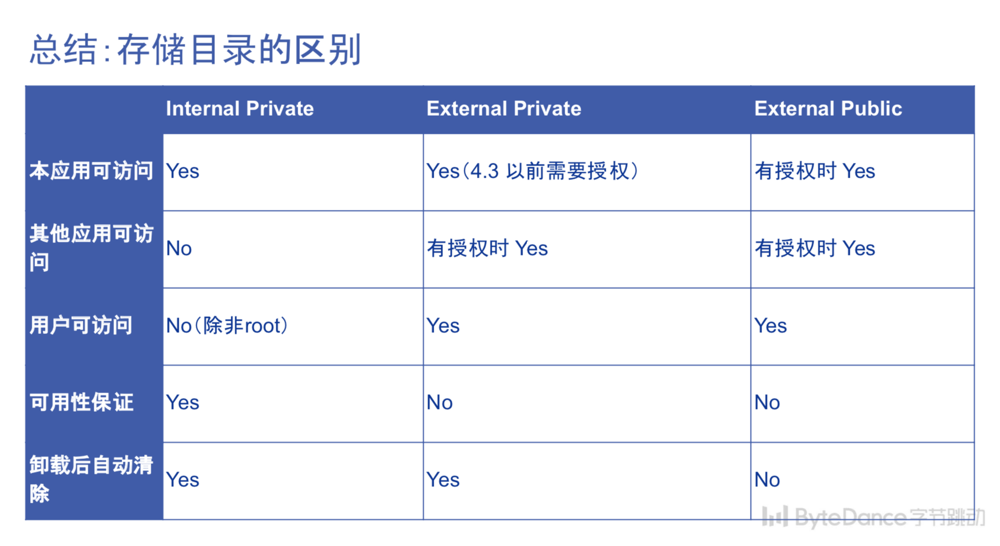

# Chapter-6 Android 存储

## (1) Storage Overview

### (1.1) 存储的逻辑分区

-   Internal storage:
    -   App-specific directory: files & cache
    -   位于 `/data/data/` 路径下的包名文件夹中
-   External storage:
    -   App-specific directory: files & cache
        -   位于 `storage/1xxx-xxxx/Android/data/` 路径下包名文件夹中
    -   Public directory: DCIM & Download & Movies



-   应用安装的位置可以在 `AndroidManifest.xml` 配置（方法略）

## (2) Files


## (3) SharedPreferences

-   使用场景：用于保存用户的settings：

-   使用方法：

    ```java
    package com.byted.camp.todolist.operation.activity;
    import android.content.SharedPreferences;
    
    public class SettingActivity extends AppCompatActivity {
    
        private static final String KEY_COMMENT = "key_comment";
    
        private Switch commentSwitch;
        private SharedPreferences mSharedPreferences;
    
        @Override
        protected void onCreate(Bundle savedInstanceState) {
            super.onCreate(savedInstanceState);
            setContentView(R.layout.activity_setting);
            // 获取 SharedPreferences （每个 SharedPreferences 对应一个xml文件）对应于将文件读到内存 
            mSharedPreferences = getSharedPreferences("custom_settings", Context.MODE_PRIVATE);
            // 读取 SharedPreferences(getBoolean/getString ...)
            boolean isOpen = mSharedPreferences.getBoolean(KEY_COMMENT, false);
    
            commentSwitch = findViewById(R.id.switch_comment);
            commentSwitch.setOnCheckedChangeListener(new CompoundButton.OnCheckedChangeListener() {
                @Override
                public void onCheckedChanged(CompoundButton buttonView, boolean isChecked) {
                    // 使用 commit 提交事件
                    SharedPreferences.Editor editor = mSharedPreferences.edit();
                    editor.putBoolean(KEY_COMMENT, isChecked);
                    editor.commit();
                }
            });
            commentSwitch.setChecked(isOpen);
        }
    
    }
    ```

-   原理简单重述：(这里虽然考虑到有Memory Cache机制，但作为初学者先不考虑Cache影响)

    -   通过 xml 文件存储用户 setting ：使用Internal storage: `/data/data/xxxx/shared_prefs/` 目录下

## (4) Database

1.  I/O操作不能放在主线程（UI线程）

2.  SQLiteDatabase建议设计成单例模式，否则多线程操作会出现异常

    ```java
    package com.byted.camp.todolist.operation.db;
    
    import android.arch.persistence.db.SupportSQLiteDatabase;
    import android.arch.persistence.room.Database;
    import android.arch.persistence.room.Room;
    import android.arch.persistence.room.RoomDatabase;
    import android.arch.persistence.room.migration.Migration;
    import android.content.Context;
    
    import com.byted.camp.todolist.operation.db.dao.UserDao;
    import com.byted.camp.todolist.operation.db.entity.User;
    
    @Database(entities = {User.class}, version = 1)
    public abstract class AppDatabase extends RoomDatabase {
    
        private static final String DATABASE_NAME = "my_app.db";
    
        private static volatile AppDatabase sInstance;
    
        public abstract UserDao userDao();
        // standard Single Instance module.
        public static AppDatabase getInstance(final Context context) {
            if (sInstance == null) {
                synchronized (AppDatabase.class) {
                    if (sInstance == null) {
                        sInstance = buildDatabase(context.getApplicationContext());
                    }
                }
            }
            return sInstance;
        }
    
        private static AppDatabase buildDatabase(Context appContext) {
            return Room.databaseBuilder(appContext, AppDatabase.class, DATABASE_NAME)
    //                .addMigrations(MIGRATION_1_2)
                    .build();
        }
    
        private static final Migration MIGRATION_1_2 = new Migration(1, 2) {
    
            @Override
            public void migrate(SupportSQLiteDatabase database) {
                //
            }
        };
    }
    ```

## (5) 调试数据库的方法

-   adb + sqlite3
-   Stetho: 
    -   Build.gradle : dependencies {implementation 'com.facebook.stetho:1.3.1'}
    -   TodoListApplication extend Application: `stetho.initializeWithDefaults` 
    -   在AndroidManifest.xml 中`<application>` 标签中添加 `android:name=".TodoListApplication"`
    -   在[chrome://inspect/#devices](chrome://inspect/#devices)

